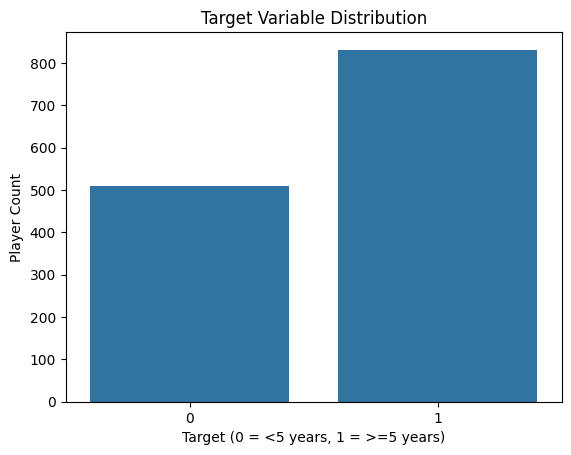
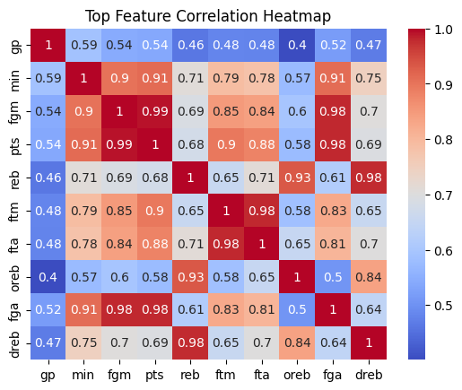
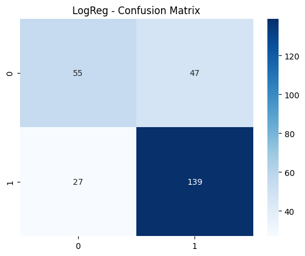
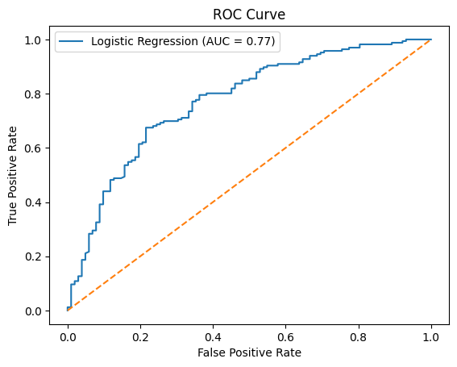
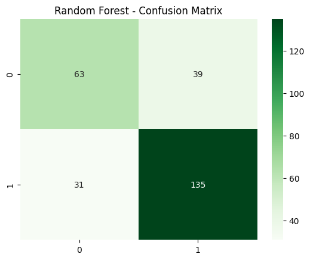
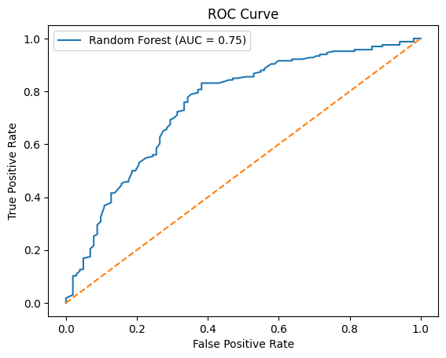

# 🏀 NBA Career Duration Prediction

This project aims to predict whether an NBA player will have a career lasting at least 5 years based on their rookie season statistics. It demonstrates an end-to-end classification workflow using Python and popular machine learning libraries.

---

## 🎯 Project Objective

To predict the long-term career trajectory (≥5 years) of NBA players using rookie season performance metrics. This binary classification task helps identify early indicators of longevity in professional basketball careers.

---

## 📦 Dataset

- **Source**: [Kaggle - NBA Player Dataset](https://www.kaggle.com/datasets/yakhyojon/national-basketball-association-nba)
- **Observations**: 1,340 players
- **Features**: Rookie season stats (e.g., points, assists, minutes, field goals)
- **Target**: `target_5yrs` (1 = career ≥ 5 years, 0 = less)

---

## 🔍 Exploratory Data Analysis (EDA)

- No missing values found
- Slight class imbalance (62% with career ≥ 5 years)
- Strong correlations observed between `gp`, `pts`, `min`, `fgm`, and career longevity
- Visualizations created with seaborn/matplotlib to explore distributions & relationships




---

## 🧠 Modeling Approach

Three classification models were developed:

- **Logistic Regression** (baseline)
- **Random Forest Classifier**
- **XGBoost Classifier**

Tuning was applied using:
- `RandomizedSearchCV` for Random Forest
- `GridSearchCV` for XGBoost

Data was split 80/20 and scaled using `StandardScaler` where needed.

---

## 📈 Evaluation Results

| Model                   | Accuracy | F1-score (1) | AUC  |
|------------------------|----------|--------------|------|
| Logistic Regression    | 0.72     | 0.79         | 0.77 |
| Random Forest (tuned)  | **0.75** | **0.80**     | 0.75 |
| XGBoost (tuned)        | 0.71     | 0.77         | **0.77** |







---

## 🌟 Key Insights

- **Games Played (gp)** is the most influential predictor in both RF and XGBoost.
- Other key factors include `pts`, `ftm`, `fg`, and `min`, highlighting performance volume and efficiency.
- The models achieved ~75-77% AUC, indicating strong generalization.

---

## 📊 Feature Importance

### Random Forest (Top 10)


### XGBoost (Top 10)


---

## 🛠 Technologies Used

- Python (pandas, numpy, seaborn, matplotlib)
- Scikit-learn (LogReg, RF, preprocessing, tuning)
- XGBoost
- Google Colab

---

## 📁 Project Structure

```
📦 nba-career-prediction/
├── data/
│   └── nba-players.csv
├── images/
│   ├── target_variable_distribution.png
│   ├── top_feature_correlation_heatmap.png
│   ├── Logistic_Regression.png
│   ├── LogReg_Curve.png
│   ├── Random_Forest.png
│   ├── Random_Forest_Curve.png
│   ├── Tuned Random Forest Confusion Matrix.png
│   ├── Tuned Random Forest Curve.png
│   ├── Top 10 Feature Importances - Random Forest.png
│   └── Top 10 Feature Importances - XGBoost.png
├── notebook/
│   └── nba_career_modeling.ipynb
├── README.md
```

---

## 👤 Author

**Christos Papakostas**  
Aspiring Data Analyst with a background in IT & trading, pivoting into data-driven roles.  
🔗 [LinkedIn](https://www.linkedin.com/in/...)  
📧 christos@email.com


---

## 📄 License

This project is licensed under the MIT License. See the [LICENSE](LICENSE) file for details.

---

## 📦 Requirements

To run this project, you need the following Python packages:

```
pandas
numpy
matplotlib
seaborn
scikit-learn
xgboost
```
You can install them using:

```
pip install -r requirements.txt
```
